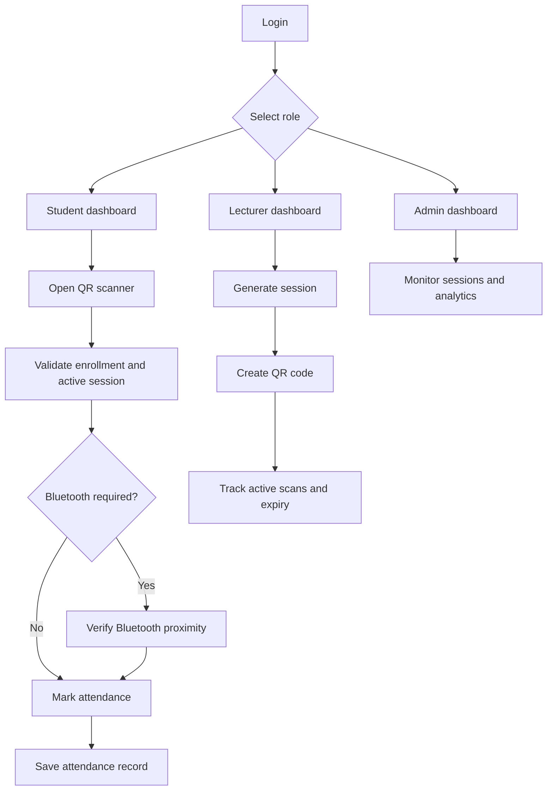

# Attendance Management System

A role-based attendance tracking web app built with React, TypeScript, Vite, Tailwind CSS, and Supabase. The system connects to a live university attendance backend with QR code scanning, lecturer-generated sessions, admin analytics, persistent local state, Bluetooth-style verification, and a unified attendance history trail for reviewing QR and Bluetooth activity together.

## What the app does

The application is organized around three roles:

- Students can view enrolled courses, scan attendance codes, review recent attendance history, and see their attendance performance.
- Lecturers can generate attendance sessions, create QR codes, monitor live scans, and end sessions when class is finished.
- Administrators can inspect university-wide attendance activity, monitor system trends, and review active sessions.

## Core Features

### Authentication and session handling

- Role-based sign-in for student, lecturer, and admin accounts backed by Supabase Auth.

### Student experience
### Lecturer experience

- Lecturer dashboard with summary cards for total students, attendance rate, active sessions, and course count.
- Session generation with configurable duration.
- QR code display for active attendance sessions.
- Live scan count and session expiry timer.
- Optional Bluetooth-required sessions for stricter attendance control.

### Admin experience

- Overview of total users, active classes, and system-wide attendance rate.
- Live session monitoring table.
- Attendance trend chart and department distribution chart.
- System activity log cards.
- Searchable active session list.

### Attendance logic

- Attendance is validated in a single shared store.
- A student must be enrolled in the course before attendance can be recorded.
- A session must be active and unexpired.
- Duplicate scans are rejected.
- Attendance records are created only after all validation passes.

### Attendance modes and audit trail

- QR attendance is handled through the shared QR scanner and attendance hook.
- Bluetooth-required sessions gate scanning until proximity verification succeeds.
- QR + Bluetooth sessions are recorded with a combined verification mode so the exact access path is visible later.
- Admins can review Bluetooth verification attempts and the broader attendance history in one place.
- The shared history helper in `src/lib/attendanceHistory.ts` merges QR attendance records and Bluetooth verification logs into a single timeline.

### Bluetooth-style attendance enforcement

- Lecturers can mark a session as requiring Bluetooth verification.
- The scanner requests Bluetooth confirmation from a user action before QR scanning begins.
- If Bluetooth is not available or verification fails, attendance is blocked.
- This works as a browser-safe hard gate, not as low-level MAC tracking.

### Persistence

- Active attendance sessions are persisted in local storage.
- Attendance records are persisted in local storage.
- Auth state is persisted in local storage.
- Settings and preferences are stored per user.

### Settings and preferences

- Profile details can be updated from the Settings page.
- Password fields are present for future expansion of account security.
- Notification toggles are available for email alerts, session reminders, weekly summaries, and scanner guidance.
- Visual theme accents can be switched from the Settings page.

### Responsive UI

- Desktop sidebar navigation for large screens.
- Mobile sheet-based navigation for smaller screens.
- Animated transitions for dashboard route changes.
- Glassmorphism-style cards and dark theme visual language.

## Feature Flow



## Main Routes

- `/login` - role-based sign-in.
- `/dashboard` - role-based dashboard redirect.
- `/courses` - student course view.
- `/scan` - student attendance scanner.
- `/classes` - lecturer class view.
- `/generate` - lecturer session generation.
- `/users` - admin user view.
- `/analytics` - admin analytics view.
- `/settings` - account and preference settings.

## Technology Stack

- React 19
- TypeScript
- Vite
- Tailwind CSS
- Framer Motion
- React Router
- Recharts
- Sonner
- Radix UI primitives

## Supabase Setup

This project is already wired for Supabase. To connect it to a live backend:

1. Create a new Supabase project.
2. Copy the project URL and anon key into `.env.local` using [`.env.example`](.env.example) as the template.
3. Run the schema in [supabase/migrations/20260408_init.sql](supabase/migrations/20260408_init.sql) from the Supabase SQL editor.
4. Create auth users for the student, lecturer, and admin demo accounts, and add the matching role metadata shown in the migration trigger.
5. Make sure the tables used by realtime subscriptions stay in the `supabase_realtime` publication. The migration already adds them.

If you create users from the Supabase dashboard, fill in user metadata for each account. At minimum, set `role` and `full_name`; for lecturer and admin users, also set `staff_id`. The trigger now infers the role from metadata and uses unique fallback IDs, which prevents the duplicate-profile error you saw when creating a lecturer account without the right metadata.

## Local Development

### Install dependencies

```bash
npm install
```

### Start development server

```bash
npm run dev
```

### Build for production

```bash
npm run build
```

### Preview production build

```bash
npm run preview
```

## Project Structure

- `src/pages/` - login, role dashboards, and settings screens.
- `src/components/layout/` - app layout and sidebar navigation.
- `src/components/ui/` - reusable UI components and attendance widgets.
- `src/hooks/` - auth, attendance, Bluetooth, and toast logic.
- `src/lib/` - shared attendance helpers and utility functions.
- `supabase/` - database schema, realtime publication setup, and future seed files.
- `src/types/` - shared TypeScript models.

## Notes

- The Bluetooth attendance flow is browser-first and depends on the Web Bluetooth API.
- True device-level proximity enforcement is limited in a standard browser and is best treated as a lecturer/beacon verification step.
- The app expects Supabase to be configured for all live data operations.

## Validation

The project currently builds successfully with `npm run build`.
